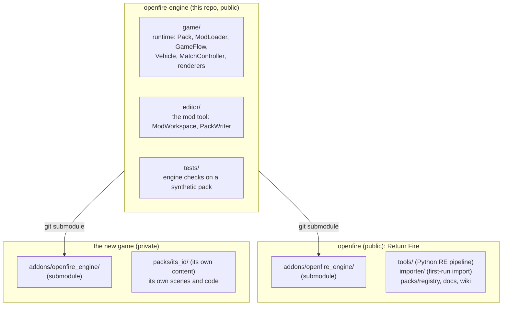
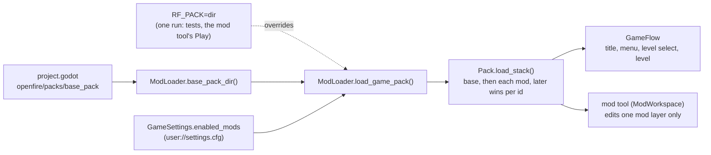

# openfire-engine

A data-driven Godot 4 engine for top-down vehicle combat games: content **packs**, **mods** layered over
them, the front-end **game flow**, the match simulation and its renderers, and a **mod tool** for editing
packs. It was extracted from [openfire](https://github.com/alexdia25/openfire), a reimplementation of
*Return Fire* (1996), and it knows no particular game. A game is a pack plus a few project settings.
This repo holds no game's content and no code specific to one game.

## How the pieces fit



Every game mounts this repo at the same place, **`res://addons/openfire_engine/`**, as a git
submodule. The engine's own paths depend on that location, the same way most Godot addons do. Nothing
flows back the other way: a game never edits files inside its submodule checkout (see
[Changing the engine](#changing-the-engine)).

## What a game tells the engine

The engine reads a few optional `ProjectSettings` keys (`game/engine_config.gd`). The game sets them
in its own `project.godot`:

| Setting | Meaning | Return Fire (`openfire`) | A bundled new game |
|---|---|---|---|
| `openfire/packs/base_pack` | the pack the game runs on | `res://packs/original_pc` in dev; `user://packs/original_pc` in the "Open Fire" export, where the pack is imported on first run | `res://packs/<id>` |
| `openfire/editor/asset_registry` | optional JSON notes the mod tool shows beside sprite ids | `res://packs/registry/asset_ids.json` | usually unset |

A setting can vary per export through Godot's feature-tag overrides, for example
`packs/base_pack.openfire_import="user://packs/original_pc"`. With nothing set, the game runs as an empty
project, which is where a brand-new game starts.



A mod's `pack.json` names its base by **id** (`"base_pack": "original_pc"`). That id is resolved next to
the mod first, then under `res://packs`, then under `user://packs` (`EngineConfig.PACK_SEARCH_ROOTS`).
So a mod works the same whether its base is bundled with the game or was generated on the player's
machine. A pack with no `base_pack` at all is a **standalone project**: a whole game made in the mod tool,
with nothing underneath it.

## Using it in a game

```bash
git submodule add https://github.com/alexdia25/openfire-engine.git addons/openfire_engine
```

Then, in the game's `project.godot`:

```ini
[application]
run/main_scene="res://addons/openfire_engine/game/game_flow.tscn"   ; or your own boot scene that changes to it

[openfire]
packs/base_pack="res://packs/my_game"
```

Enabling the plugin (Project Settings > Plugins > Open Fire Engine) is optional. It only lists the
settings above in the Project Settings dialog; the classes and scenes work without it. The mod tool is
`res://addons/openfire_engine/editor/editor_main.tscn`.

The pack format (`pack.json`, `sprites/`, `vehicles/`, `levels/`, `audio/`, ...) is the one `Pack`
(`game/pack.gd`) reads and `PackWriter` (`editor/pack_writer.gd`) writes. See
[`docs/ARCHITECTURE.md`](docs/ARCHITECTURE.md) for the runtime's internals.

## Changing the engine

Anything a game needs falls into one of three tiers:

1. **It can be pack data** using the engine's existing vocabulary: no engine change, nothing to sync.
2. **It generalises** into something the engine should support natively: a normal PR to this repo, and
   every game picks it up when it bumps its submodule.
3. **It is one-off** for one game: it stays entirely in that game's repo, composing or extending engine
   classes, and is never edited inside the submodule checkout.

The rule that keeps the engine reusable is that it **names no game**. A file name, sprite id, level id
or format that only one game has belongs in that game's repo. Return Fire's binary-format parsers
(`ART.CAR`, `.RFM`, `.SDT`) and its first-run importer stay in `openfire`. They reuse the engine's
`PackWriter` to write their output and add nothing here. Comments that cite "document NN" refer to
the [openfire wiki](https://github.com/alexdia25/openfire/wiki)'s worked examples. Those pages are where
most of this engine's behaviour was traced from, and they stay there as its history.

## Tests

```bash
GODOT=/path/to/Godot_v4.7 tools/run_tests.sh
```

This runs every check in `tests/` headless against a small synthetic pack that
`tests/fixtures/synthetic_pack.gd` writes fresh each run, so the engine is tested with no game present.
The script creates a bare harness project in `.harness/` that mounts this checkout as an addon. Remove it
with `tools/run_tests.sh --clean`, not `rm -rf`: on Windows the mount is a junction. Each game built on
the engine also runs its own checks against its real pack, and those cover what needs a playable pack
(a full match, the HUD, the front end).
