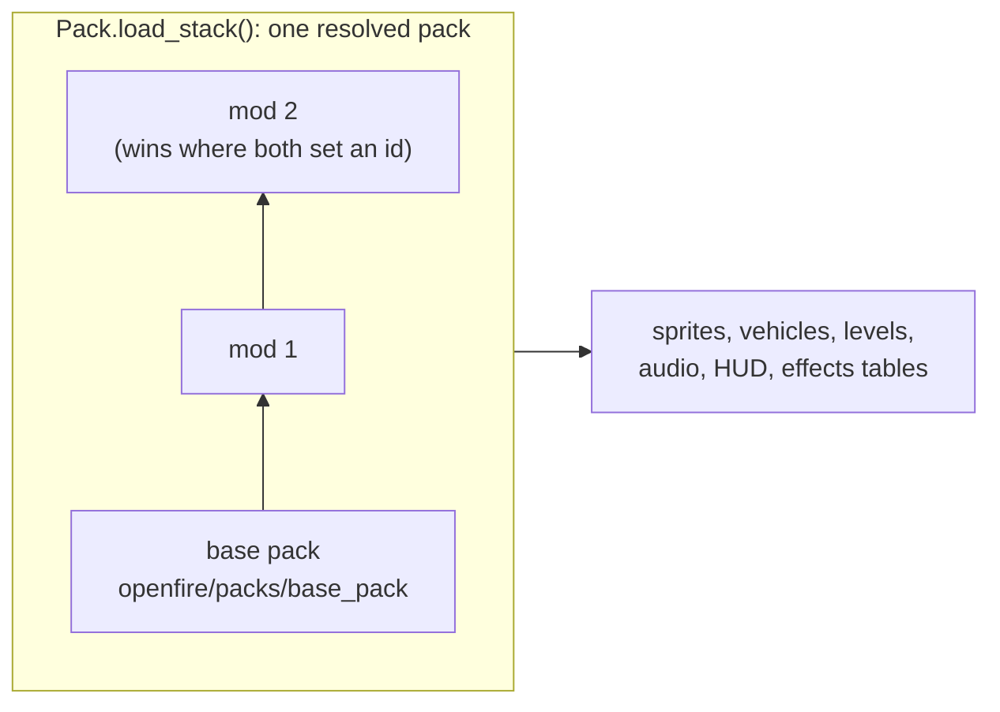
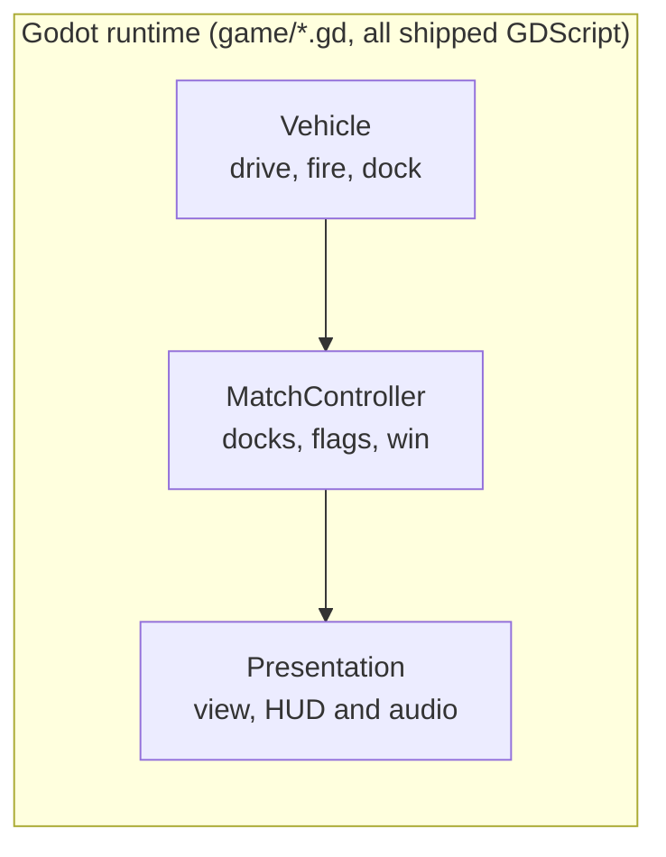
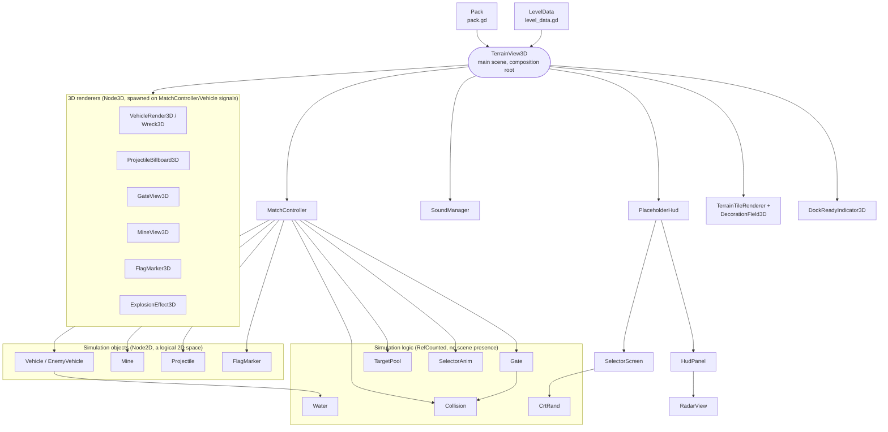
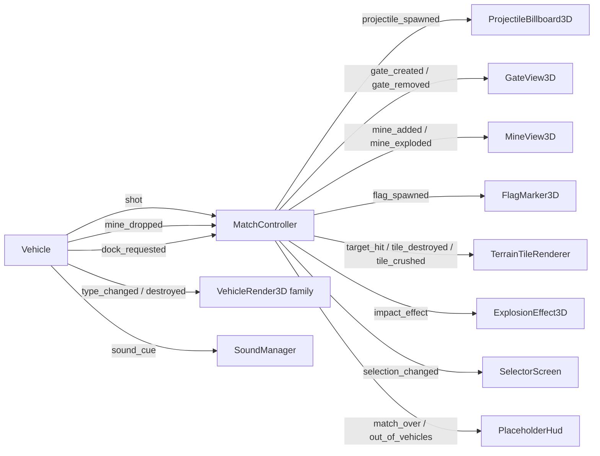

# Architecture

How the engine's runtime is put together. For what a game sets and how it mounts the engine, see the
[README](../README.md). For how each piece was traced from the original *Return Fire*, see the
[openfire wiki](https://github.com/alexdia25/openfire/wiki/) (the "document NN" references in comments).

## Packs and mods

`Pack` (`game/pack.gd`) loads a **stack** of pack directories: the game's base pack, then each enabled
mod on top of it. A mod overrides the base per id (one sprite, one vehicle definition, one sound cue,
one level) rather than replacing it wholesale, and a null value removes an id. `ModLoader`
(`game/mod_loader.gd`) decides what the stack is: the project's `openfire/packs/base_pack`, plus
`GameSettings.enabled_mods` in order, skipping any mod that fails to load. If the stack as a whole
won't load, it falls back to the base pack alone. The `Pack` node in the diagrams below stands for
that whole resolved stack.

The mod tool (`editor/`, scene `res://addons/openfire_engine/editor/editor_main.tscn`) is a second,
separate scene over the same `Pack`. It opens one mod layer as a `ModWorkspace`, edits it live, and
writes only that layer back through `PackWriter`. It never edits the base pack, and it shares no
state with the game scene.

## The game flow

`GameFlow` (`game/game_flow.tscn`, the usual main scene) owns the front end: title, main menu,
settings, level select, then the level itself, plus any intro/outro/mid-level story scenes the
level's flow names. When a level starts it instances `terrain_view_3d.tscn`, which is where the
runtime internals below begin. A game that needs a step before the title screen, such as Return
Fire's first-run import of the player's own files, uses its own boot scene as the main scene and
changes to `GameFlow` when that step is done. The engine's flow needs no hook for this.

## Runtime internals

### At a glance

`Vehicle` is the per-vehicle simulation; `MatchController` is the orchestrator (docking,
mines, flags, the win condition); everything else only reads that state to show or play it:

That's the shape worth keeping in your head day to day. The rest of this section is the same
picture again, twice, each pass trading simplicity for one more layer of the actual code.

### Composition: what creates what

`game/terrain_view_3d.gd` (no `class_name`; the level scene's own script,
`res://addons/openfire_engine/game/terrain_view_3d.tscn`) is the composition root of a running level — it builds `Pack` and
`LevelData`, then creates `MatchController` and `SoundManager` as children, and reactively
adds a 3D renderer node any time `MatchController`/`Vehicle` announces something new (a
vehicle, a shot, a gate). Everything below is real `.new()`/`add_child()` calls in that file
and in `MatchController`, not a simplification:

The split down the middle is real, not incidental: `Vehicle`, `Mine`, `Projectile` and
`FlagMarker` all `extend Node2D` — the simulation runs entirely in a logical 2D space (the
same coordinate system the original game's fixed-point code used), with no 3D representation
of its own. Every `*_3d.gd` node under **3D renderers** only *reads* one of those Node2D
objects each frame and draws it in the actual 3D scene — it owns no gameplay state. `Gate`,
`TargetPool`, `SelectorAnim`, `Water`, `Collision` and `CrtRand` are plainer still: they
`extend RefCounted`, so they never enter the scene tree at all, just plain data/logic objects
`MatchController` (or another RefCounted object) holds a reference to.

### Signal flow

`MatchController` and `Vehicle` never reach into a renderer directly; they emit signals and
`terrain_view_3d.gd` (or `SoundManager`, or the HUD) is what's listening:

One exception: `DockReadyIndicator3D` polls `MatchController.can_dock(vehicle)` every frame
(document 80) rather than waiting on a signal, since "am I currently eligible to dock" is a
continuous condition, not a discrete event.

The engine's own `tests/*.gd` check what holds for any game (packs, mods, standalone projects, the
pure maths) against a synthetic pack; a game's own headless checks drive `MatchController`/`Vehicle`
directly (no scene, no renderer) against its real pack — for Return Fire, the traced tick counts,
damage and stock against the disassembly (openfire's `tools/tests/`).

---
*Diagrams are hand-authored and were last cross-checked against real `class_name`/`extends`
declarations and `.new()`/`add_child()` call sites in `game/` on 2026-10-01 (the split out of
openfire, issue alexdia25/openfire#62). Regenerate them if the module boundaries above drift.*
