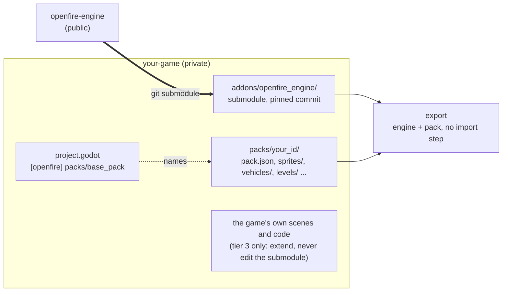

# Starting a new game on the engine

How to set up a new game that runs on openfire-engine: its own repo, its own content, and the engine as a git
submodule. This is step 3 of [alexdia25/openfire#62](https://github.com/alexdia25/openfire/issues/62), written down so
it can be done whenever the game has a name. [openfire](https://github.com/alexdia25/openfire), the Return Fire
reimplementation, is a working example of a consumer. Its one difference is that it imports its content from the
player's machine instead of bundling it.



## 1. Create the repo and add the engine

```bash
gh repo create alexdia25/your-game --private --clone
cd your-game
git submodule add https://github.com/alexdia25/openfire-engine.git addons/openfire_engine
```

Mount the engine at exactly `addons/openfire_engine/`. Its own scene and script paths
(`res://addons/openfire_engine/...`) depend on that location.

Anyone cloning the game later needs the submodule too:
`git clone --recurse-submodules ...`, or `git submodule update --init` in an existing clone.
Each clone should also run `git config push.recurseSubmodules check`, which refuses to push a game commit whose
engine commit isn't pushed yet.

## 2. Make the Godot project

Create a Godot 4.7 project in the repo root (GL Compatibility renderer, like the engine's harness). Then put these
lines in its `project.godot`:

```ini
[application]

run/main_scene="res://addons/openfire_engine/game/game_flow.tscn"

[editor_plugins]

enabled=PackedStringArray("res://addons/openfire_engine/plugin.cfg")

[openfire]

packs/base_pack="res://packs/your_id"
```

- `run/main_scene`: the engine's front end (title, menu, level select, levels). If the game needs a step before the
  title, give it a boot scene of its own that changes to `game_flow.tscn` when done. openfire's `importer/boot.tscn`
  does this for its first-run import. A game can also add its own buttons to the Settings screen with
  `GameFlow.add_settings_entry(label, callable)`.
- `[editor_plugins]`: optional. It only lists the engine's settings in Project Settings.
- `packs/base_pack`: the pack the game runs on. The README's
  [What a game tells the engine](../README.md#what-a-game-tells-the-engine) lists every setting.

Copy the engine's `.gitignore` entries for `.godot/` and the like. Add a `packs/.gdignore`, an empty file, so the
editor treats the pack as data rather than importing every PNG in it. Packs are always read straight from their
files at runtime, never through `res://` import (see step 5 for what that means at export time).

## 3. Make the pack

Open the mod tool, `res://addons/openfire_engine/editor/editor_main.tscn`, and use **New game...** on
`packs/your_id`. That writes a **standalone project**: a `pack.json` with `"base_pack": ""`, so nothing sits
underneath it, and every editor panel works on it as it would on a mod. Set the manifest's `"id"` to `your_id` and
`"title"` to the game's name; the title screen shows `title`. Add sprites, vehicles (`vehicles/<id>/vehicle.json` plus
`vehicles/roster.json`) and levels from there, or write the files directly. `Pack` (`game/pack.gd`) is the reference
for what each file holds.

Commit the pack. Unlike Return Fire's, it is the game's own content.

## 4. Check it runs

```bash
godot --path . --audio-driver Dummy
```

This should show the pack's title. A headless check in the game's own `tests/` folder, modelled on the engine's
`tests/*.gd`, can load the pack with `ModLoader.load_game_pack()` and assert what the game relies on. The engine's own
checks run from the submodule (`addons/openfire_engine/tools/run_tests.sh`) and need nothing from the game.

## 5. Export with the pack inside

The pack's files are plain data (JSON, PNG, WAV), so a preset's resource filters don't pick them up, and an include
filter can't reach into a folder with a `.gdignore`. Godot's export filters never look inside ignored folders. That
leaves two ways to get the pack into the export:

- **An export plugin**, recommended because the editor stays clean. A small `EditorExportPlugin` adds every file under
  `packs/your_id` with `add_file()` in `_export_begin()`. openfire's `addons/open_fire_export/plugin.gd` does exactly
  this for its asset registry, in about 25 lines; walk the pack folder instead of adding one file.
- **No `.gdignore` on `packs/`**, plus an include filter of `packs/your_id/*` in the preset. That's simpler to set up,
  but the editor will then import every PNG in the pack as a texture it never uses.

Also exclude `addons/openfire_engine/tests/*` and `addons/openfire_engine/tools/*`, and any `tests/*` of the game's
own. Then check the build: exporting a `.pck` with `godot --headless --export-pack "<preset>" game.pck` and running it
with `godot --main-pack game.pck` from an empty folder should reach the title screen.

This build never contains Return Fire's importer or converters, because they exist only in the openfire repo. That
is what keeps the bundled game independent of Return Fire's import code: the separation is structural, not
something an export filter has to enforce.

## 6. Day to day

- **Update the engine:** `git submodule update --remote addons/openfire_engine`, run the game's checks, then commit the
  new submodule pointer.
- **Change the engine:** use the README's [three tiers](../README.md#changing-the-engine). Try pack data first.
  If the change generalises, it is an engine change. If it is one-off, it goes in the game's own code
  (composing or extending engine classes), never in the submodule. An engine change can be developed right inside
  the game's `addons/openfire_engine/` with nothing committed until it works. See
  [Developing the engine from a game checkout](../README.md#developing-the-engine-from-a-game-checkout): push the
  engine first, then the game with the new pointer.
